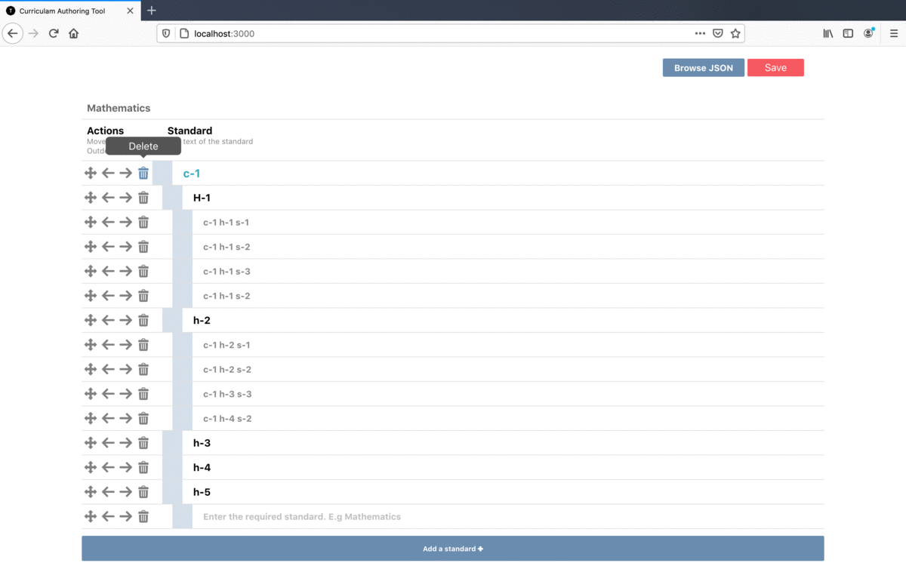

# Curriculum Authoring Tool 
Created a tool for teachers to author curriculum for a subject. The curriculam subject is composed of 
```
1. Chapters 1 
   - Headings 1
     - Subheadings 1
2. Chapters 2 
   - Headings 1
     - Subheading 1
     - Subheading 2
     
```
     
## Project Demo



## Features

 - [x] Row actions - Indent/ Outdent/ Delete 
 - [x] Preserve parent-child relations between nodes while deleting intending etc.
   Eg. deleting an element should also delete its children
 - [x] The text in each row should be editable like a text box
 - [x] Load/ Save - Functionality to generate and download a JSON output and
    to load the JSON to create the structure again   
 - [x] No backend used
 - [x] UI features Eg. tooltips
 - [x] UI Validations Eg. reaching highest or lowest indent, parent child relation 
 - [x] Drag and drop feature which user can move chapter heading subheading

## TODO
-  Nesting with *n* number of sub children
-  Testing

## Downloaded API Format
```
{
	"subject": "Mathematics",
	"children": {
		"1": {
			"name": "c-1",
			"children": {
				"101": {
					"name": "h-1",
					"children": {
						"1001": {
							"name": "c-1 h-1 s-1"
						},
						"1002": {
							"name": "c-1 h-1 s-2"
						},
						"1003": {
							"name": "c-1 h-1 s-3"
						},
						"1004": {
							"name": "c-1 h-1 s-4"
						}
					},
					"childrenAllIdsOrder": [1001, 1002, 1003, 1004]
				},
				"102": {
					"name": "h-2",
					"children": {
						"1005": {
							"name": "c-1 h-2 s-1"
						},
						"1006": {
							"name": "c-1 h-2 s-2"
						},
						"1007": {
							"name": "c-1 h-2 s-3"
						},
						"1008": {
							"name": "c-1 h-2 s-4"
						}
					},
					"childrenAllIdsOrder": [1005, 1006, 1007, 1008]
				},
				"103": {
					"name": "h-3",
					"children": {},
					"childrenAllIdsOrder": []
				},
				"104": {
					"name": "h-4",
					"children": {},
					"childrenAllIdsOrder": []
				},
				"105": {
					"name": "h-5",
					"children": {},
					"childrenAllIdsOrder": []
				}
			},
			"childrenAllIdsOrder": [101, 102, 103, 104, 105]
		}
	},
	"childrenAllIdsOrder": [1]
}
```

## Build with
This section should list any major frameworks that you built your project using.
- [React.js] 
- [node-sass]


## Installation

Curriculam Authoring Tool requires [Node.js](https://nodejs.org/) v12+ to run.

Install the dependencies after cloning the repo and start the server.

```sh
$ git clone https://github.com/salil0001/curriculum-authoring-tool.git
$ yarn install 
$ yarn start
```
## Contributions

Contributions are what make the open source community such an amazing place to be learn, inspire, and create. Any contributions you make are **greatly appreciated**.
  
1. Clone the Project
2. Create your Feature Branch (git checkout -b feature/AmazingFeature)
3. Commit your Changes (git commit -m 'Add some AmazingFeature')
4. Push to the Branch (git push origin feature/AmazingFeature)
5. Open a Pull Request
  
  
   [React.js]: <https://reactjs.org/>
   [node-sass]:<https://www.npmjs.com/package/node-sass/>
   [Deployment-Link]:<https://www.npmjs.com/package/>
# Task
# Task-1
# task
